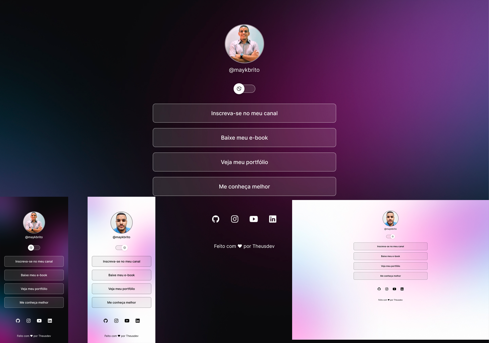

<h1 align="center"> Multi Links </h1>

Multi Links é um projeto gratuito e de desenvolvimento próprio para facilitar a distribuição dos links e redes sociais.  

  <a href="#-tecnologias">Tecnologias</a>&nbsp;&nbsp;&nbsp;|&nbsp;&nbsp;&nbsp;
  <a href="#-projeto">Projeto</a>&nbsp;&nbsp;&nbsp;|&nbsp;&nbsp;&nbsp;
  <a href="#-layout">Layout</a>&nbsp;&nbsp;&nbsp;|&nbsp;&nbsp;&nbsp;
  <a href="#memo-licença">Licença</a>

  

 

  

## 🚀 Tecnologias

Esse projeto foi desenvolvido com as seguintes tecnologias:

- HTML e CSS
- JavaScript
- Git e Github
- Figma

## 💻 Projeto

Esse é um projeto desenvolvido para ajudar pessoas que precisam de uma pagina com varios links, com layout super atualizado, função dark e light, e no futuro esse projeto terá uma area de admin para que a pessoa consiga
editar facilmente seus links, foto do perfil e redes sociais. 

- [Visite o projeto online](https://theusdev.github.io/devlinks)

## 🔖 Layout

Você pode visualizar o layout do projeto através [DESSE LINK](https://www.figma.com/file/VTWSCs3xqUMIUwgXGjQLTX/DevLinks-%E2%80%A2-Projeto-Discover-(Community)?type=design&node-id=0%3A1&t=uNVnwkijJbAcvNpt-1). É necessário ter conta no [Figma](https://figma.com) para acessá-lo.

## :memo: Licença

Esse projeto está sob a licença MIT.

---

Feito com ♥ Theusdev
